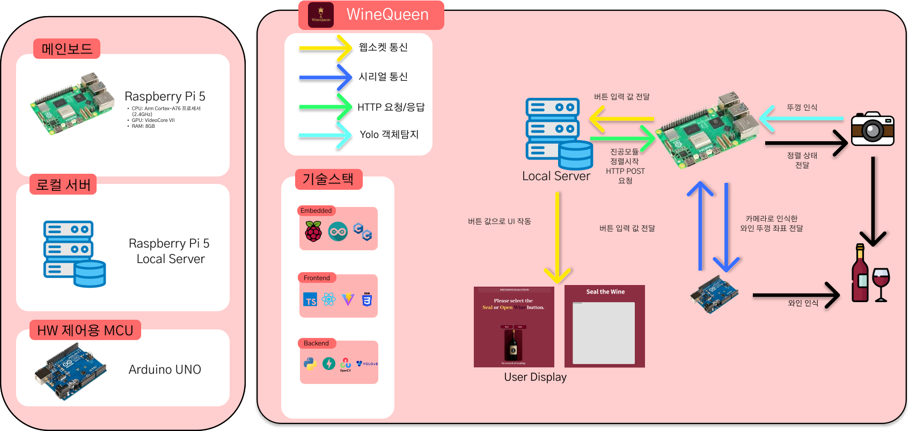
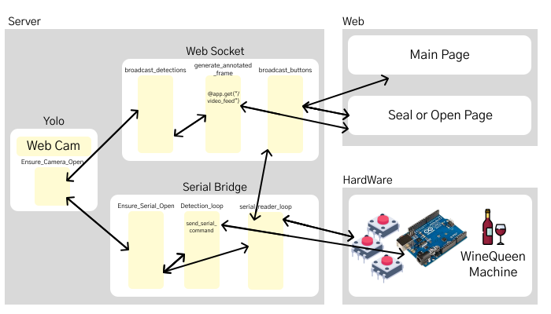
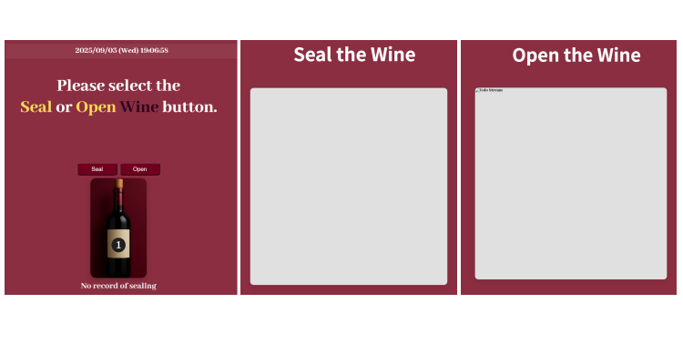
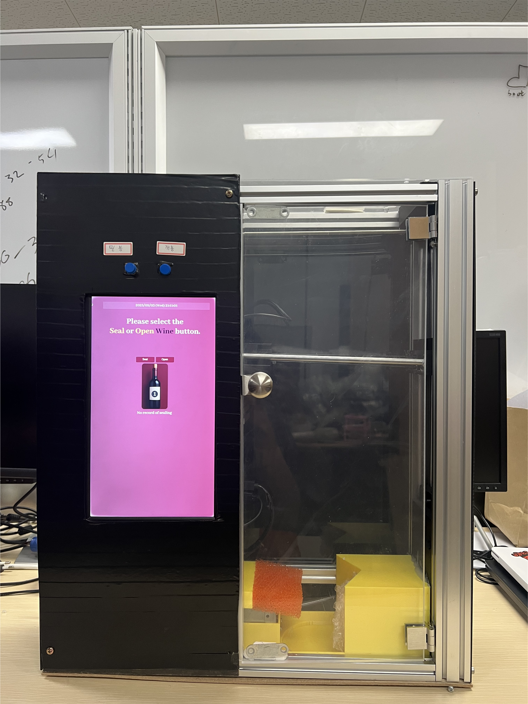

# WineQueen

WineQueen is an embedded system that seals and opens wine bottles automatically. It combines a two-axis mechanism, vacuum control, camera-based bottle alignment, a FastAPI control server, and a React device interface.



## Development demo

[](https://www.youtube.com/watch?v=y1499OYCkKM)

The development video demonstrates the integrated prototype and its automatic sealing and opening workflow. For the full engineering narrative, see the [development report summary](docs/development-report.md) or the [original 18-page report](docs/WineQueen-development-report.pdf).

## What it does

- Detects the bottle opening with a YOLO-based vision pipeline.
- Aligns the mechanism through serial commands exchanged with an Arduino.
- Runs separate sealing and opening state machines.
- Streams the annotated camera feed to the device UI.
- Accepts commands from either physical buttons or the web interface.
- Returns the mechanism to a known home position after each operation.

## Architecture



The Raspberry Pi hosts the vision pipeline and FastAPI server. The Arduino handles deterministic motor, electromagnet, vacuum-pump, limit-switch, and button control. REST endpoints start operations, while WebSocket messages synchronize physical inputs and UI state.



## Repository layout

```text
.
|-- assets/       Architecture diagrams and project images
|-- backend/      FastAPI, OpenCV, YOLO, serial bridge, and state control
|-- docs/         Development report and technical summary
|-- embedded/     Arduino firmware for the mechanical system
`-- frontend/     React and TypeScript device interface
```

## Local setup

### Backend

```bash
python -m venv .venv
source .venv/bin/activate
pip install -r backend/requirements.txt
cp backend/.env.example .env
uvicorn backend.main:app --host 0.0.0.0 --port 8000
```

On Windows, activate the environment with `.venv\Scripts\activate` and create `.env` manually from the example.

The trained model weights are intentionally not stored in this repository. Set `WINEQUEEN_MODEL_PATH` to a compatible Ultralytics model before starting the backend.

### Frontend

```bash
cd frontend
npm ci
cp .env.example .env.local
npm run dev
```

Set `VITE_API_ORIGIN` only when the backend is hosted on a different origin. Otherwise, the frontend uses its current origin.

## Hardware

The reference prototype uses a Raspberry Pi, an Arduino-compatible controller, two stepper axes, limit switches, an electromagnet, a linear actuator, a vacuum pump, and a USB camera. Pin assignments and calibrated travel values are documented in [`embedded/WINEQUEEN_HW.ino`](embedded/WINEQUEEN_HW.ino).



## Safety notes

This repository documents a prototype. Verify motor direction, travel limits, emergency-stop behavior, and actuator power stages before operating it on physical hardware. Calibrated distances in the firmware are specific to the original mechanism.

## Project context

WineQueen was developed as team 1091's entry in the free competition category of the 23rd Embedded Software Contest. This public version includes the implementation, demonstration link, and development report; datasets, trained weights, raw videos, and administrative documents are excluded.
